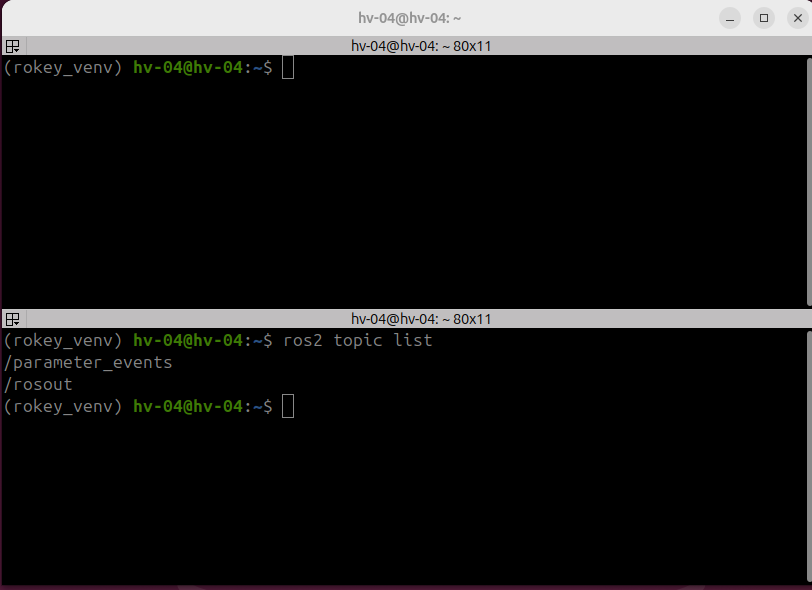
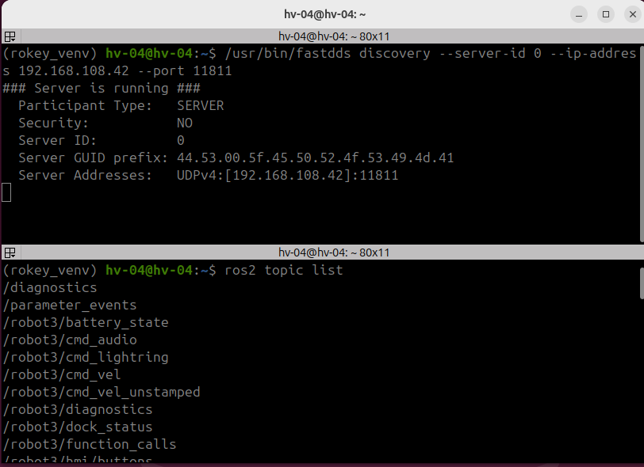

## 오늘 한 일
1. ROS 통신 환경 구축
2. DB 선정 및 스키마 1차 구현

## 시행착오
1-1. 의도된 통신 방식과 구축된 통신 방식 간 차이

     [의도] 로봇 클라이언트는 제어 PC를 서버로 연결된다.

     [구축] 로봇 클라이언트도 관제 PC를 서버로 연결된다.
 
     [결론] 제어 PC도 관제 PC에 클라이언트로 연결되므로, 제어 PC와 로봇 간 통신은 문제가 없고, 추후 확장성 및 구현 안정성을 고려하여 현재 구축 설정을 유지한다.

2-1. server page 및 client page 의 활용

     [server page] : 관제 PC에서 DB 작업 및 대부분의 데이터 관리

     [client page] : 로봇에 대한 일부(비전, 긴급 관리 등) 기능 관리

## 강조하고 싶은 것 / 달성
<!-- 이 줄은 노션에 안 나가요. 그림:   이름에 빈칸이 있으면 
     영상: video: video/YYYY-MM-DD_이름.mp4 설명   YouTube: video: https://youtu.be/… 설명 -->

![DB 구조도 1차 postgresql] (img/db_architecture_1_postgresql.png)
![DB 구조도 1차 redis] (img/db_architecture_1_redis.png)

## 내일 할 일
1. DB 스키마 정리 = DB 스키마 2차 구현
2. WEB 기반 UI 구현
3. 테스트 데이터 구현(더미 데이터 또는 가상 로봇)
4. 테스트 데이터 기반 UI 확인 

## 막힌 것 (PM 도움 필요)
- 없음
