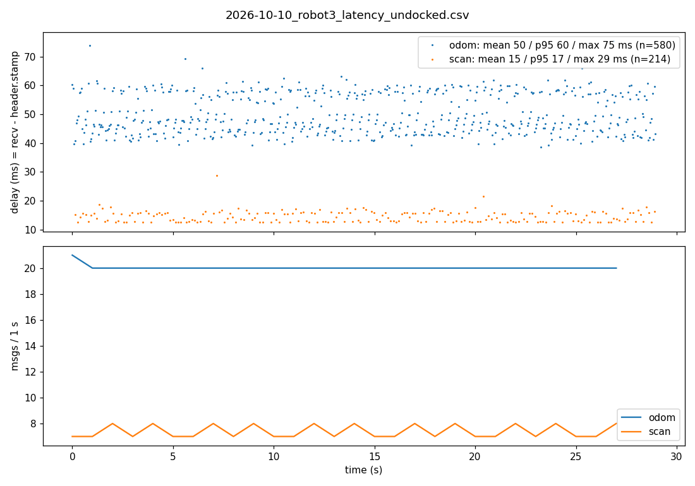
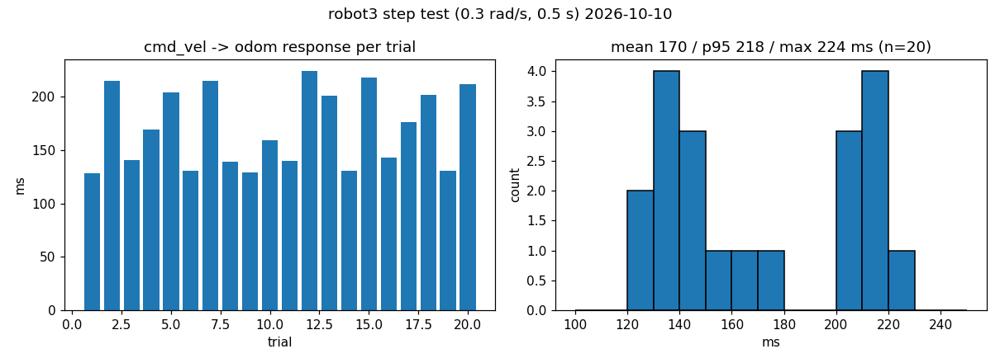
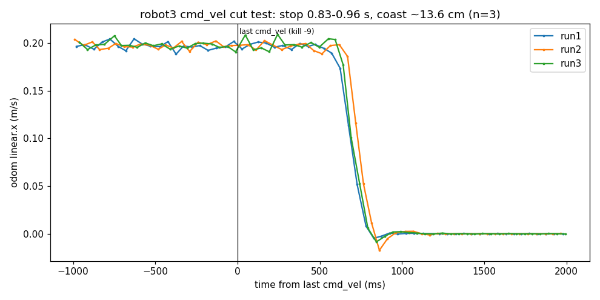
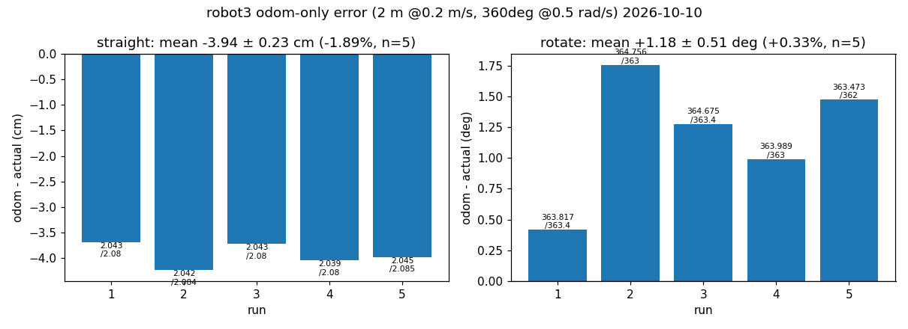
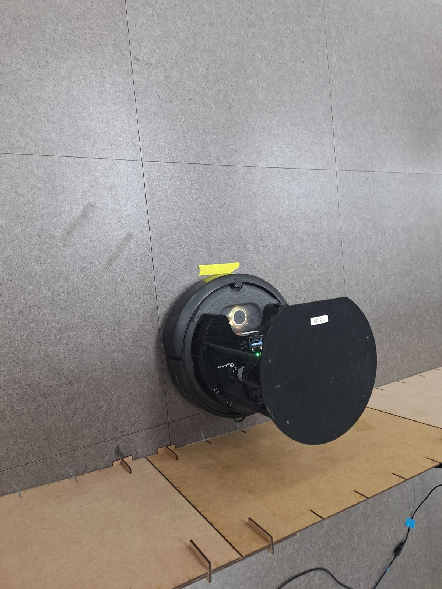
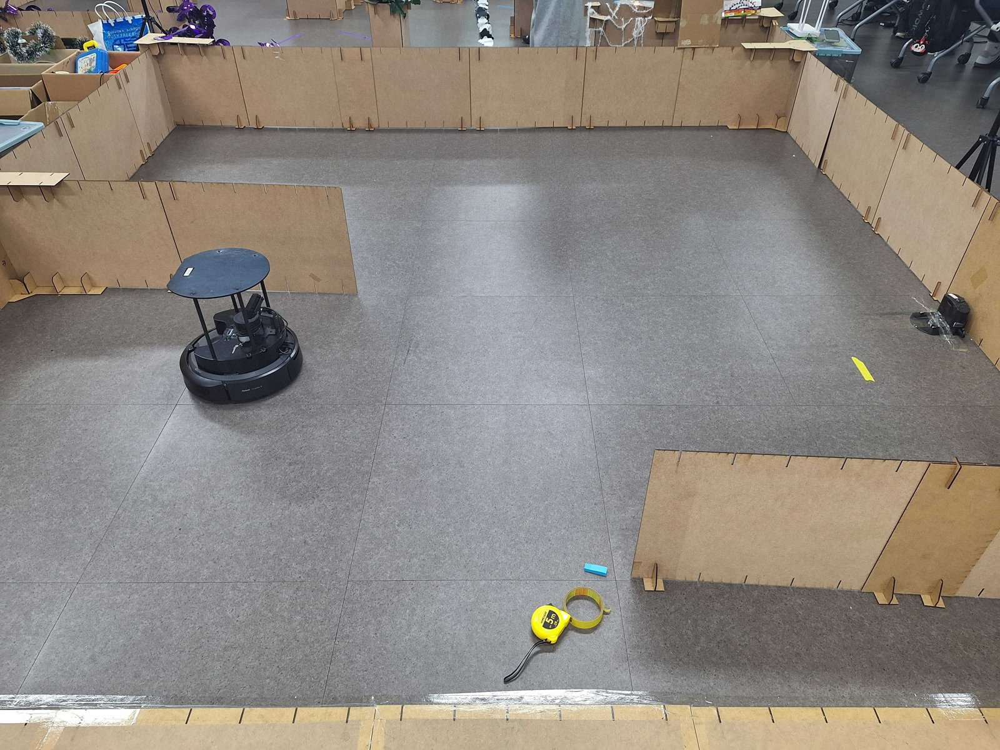
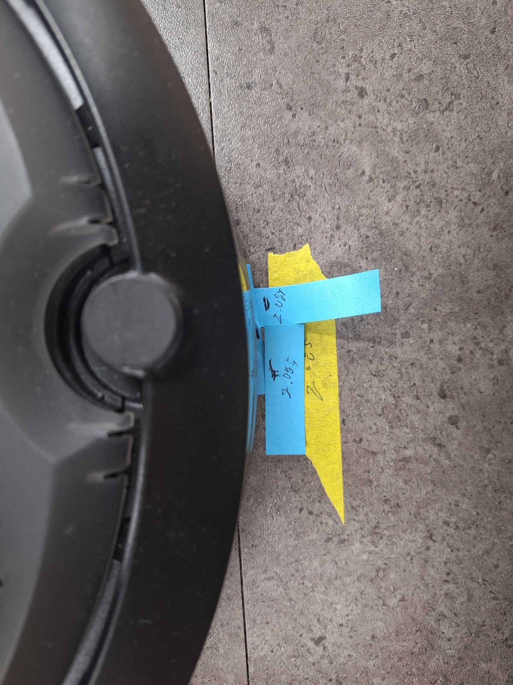
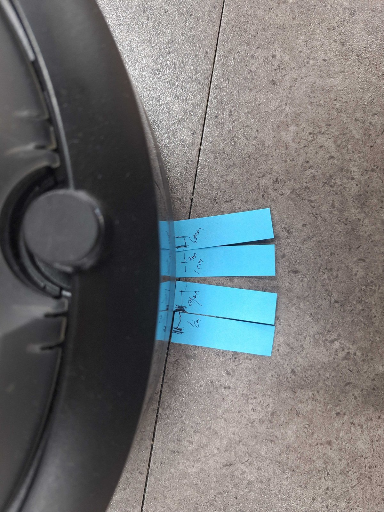
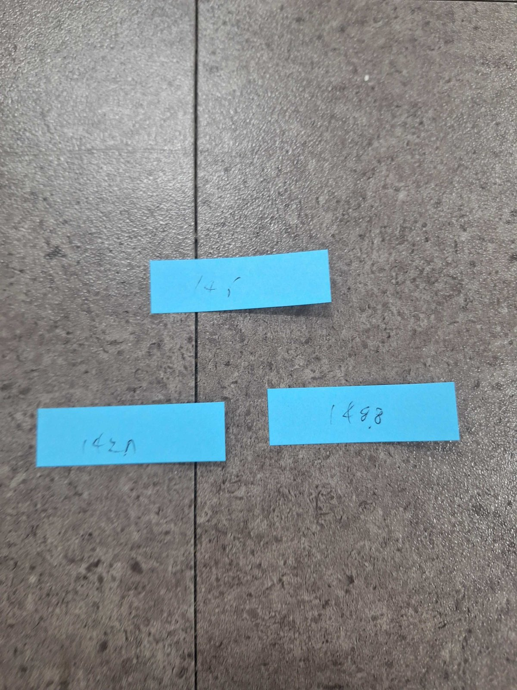
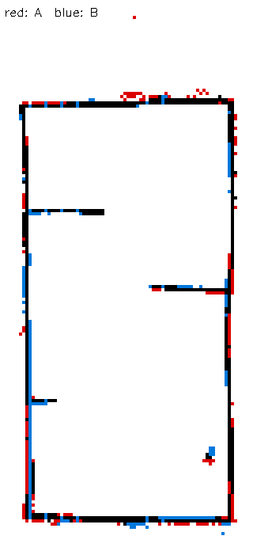

## 오늘 한 일
- 주행 업무 계획 `docs/driving/PLAN.md` v0.2 작성 (목표치 확정, 1–6단계)
- 1단계 측정 스크립트 작성: `scv_nav/scripts/latency_check.py`(수신 지연·명령 반응 지연), `odom_check.py`(odom 단독 오차)
- robot3 실측 (1-1 ~ 1-4)
  - 1-1 토픽 주기: odom 20.0 Hz, tf 30.0 Hz, scan 7.4 Hz (도킹 중에는 라이다 꺼짐 → 언도킹 후 측정)
  - 1-2 수신 지연: scan 평균 15 ms (p95 17), odom 평균 50 ms (p95 60). 명령→반응(cmd_vel→odom) 평균 170 ms, p95 218 ms
  - 1-3 명령 끊김: kill -9 로 cmd_vel 을 끊으면 0.83–0.96초 뒤 스스로 정지, 끊긴 뒤 약 14 cm 더 이동 (3회 모두)
  - 1-4 odom 오차: 직진 2 m 에서 odom 이 −3.9 ± 0.2 cm (−1.9%) 적게 셈, 회전 360° 에서 +1.2 ± 0.5° (+0.3%)
  - 1-5 SLAM: 테스트베드 지도 작성(0.05 m, 69×138 px, 주행 공간 약 3.2 × 6.5 m, 19.98 m²) → RSSI 팀 test_map 과 비교
- 1단계 측정 기록을 `docs/driving/MEASUREMENTS.md` 로 정리 (수신 지연 mean/p95/max, 반응 지연 20회, 끊김 3회, odom 오차 5회씩, Nav2 bringup 참고값). 원본 CSV 는 `docs/driving/data/`
- 지도 원점 정리본 `testbed_v1`: 주행 공간 안쪽 왼쪽 아래 모서리 = (0, 0) (지도 그림은 그대로, origin 만 이동)
- 초기 위치 방식 결정: 두 로봇이 같은 지도를 쓰고, 로봇별 "언도킹 직후 pose" 를 기록해 초기 pose 로 사용 (도킹 중에는 라이다가 꺼져 AMCL 보정 불가)

## 시행착오
- 처음에 토픽이 안 보임: 비대화형 셸이라 `~/.bashrc`(ROS_DOMAIN_ID·Discovery Server)가 적용되지 않았고, daemon 을 재시작한 직후라 목록이 비어 있었음 → 두 setup 파일을 직접 source, daemon 은 건드리지 않기
- 도킹 중 scan 이 0개: TurtleBot4 가 도킹 중 라이다를 끔 → 언도킹 후 정상 (7.4 Hz)
- 같은 폴더에서 다른 작업이 브랜치를 바꾸고(feature/driving) 같은 커밋을 다시 cherry-pick 해 스크립트에 충돌 표시가 섞임 → cherry-pick 취소로 복구. 측정 커밋은 feature/driving 으로 옮김
- 직진 5회차 실측 2.045 m 는 오측정 → 재측정 2.085 m 로 대체
- SLAM 지도가 RViz 에 안 보임: odom 을 초기화하지 않아 로봇이 odom 기준 (−17.8, −1.4) m 에 있었고, 지도가 화면 밖에 그려짐 → Views 의 Target Frame 을 base_link 로. 다음부터는 SLAM 전에 `reset_pose`
- Dock 위치를 원점으로 잡으려 했으나, SLAM 종료 후라 map↔odom 관계를 알 수 없어 지도에서 Dock 위치를 특정할 수 없었음 → 벽 모서리 기준 원점으로 변경
- 각도기가 없어 회전 오차는 범퍼 끝(중심에서 약 17 cm)의 어긋난 거리로 환산: 각도 ≈ atan(mm ÷ 170), 1 mm ≈ 0.34°

## 강조하고 싶은 것 / 달성
<!-- 이 줄은 노션에 안 나가요. 그림:   이름에 빈칸이 있으면 
     영상: video: video/YYYY-MM-DD_이름.mp4 설명   YouTube: video: https://youtu.be/… 설명 -->
- odom 은 직진에서 거리와 상관없이 약 1.8–1.9% 적게 셈 (2 m 시험 −1.9%, 명령 끊김 시험 1.4 m 구간 −1.8%) → 반복성이 좋은 계통 오차라 보정하기 쉬움, AMCL(2단계) 설정에 반영
- 명령이 끊겨도 로봇이 약 0.9초 안에 스스로 멈춤. 다만 0.2 m/s 에서 약 14 cm 를 더 가므로, 장애물 이격 30 cm 기준의 절반 가까이를 씀 → 측정 속도(3-5) 정할 때 고려
- 명령→반응 지연 p95 약 220 ms: Nav2 컨트롤러 20 Hz 기준 약 4주기 늦음 → 컨트롤러 튜닝(3-3) 때 고려
- 오늘 만든 지도와 RSSI 팀 지도가 거의 같음: 벽 99% 가 10 cm 이내로 겹침(평균 0.7 cm, p95 5 cm), 칸막이 3개 위치 동일. 두 지도 사이 회전 0.8° (7 m 끝에서 약 10 cm) → 기준 지도는 하나로 통일해야 함

## 내일 할 일
- 기준 지도 확정(testbed_v1 권장) → 저장소에 넣고 RSSI·관제 팀과 공유
- 2-1: robot3·robot4 언도킹 직후 pose 3회씩 측정 → 평균을 dock_poses.yaml 로 기록
- 2-2 AMCL 튜닝(odom −1.9% 계통 오차 반영), 2-3 pose_ok 기준
- robot4 도 1-1 ~ 1-4 같은 측정 (두 로봇 비교)

## 막힌 것 (PM 도움 필요)
- 없음
