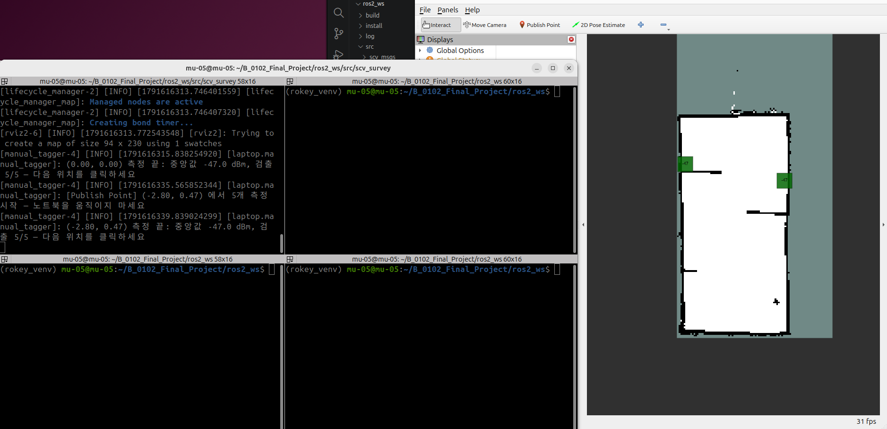
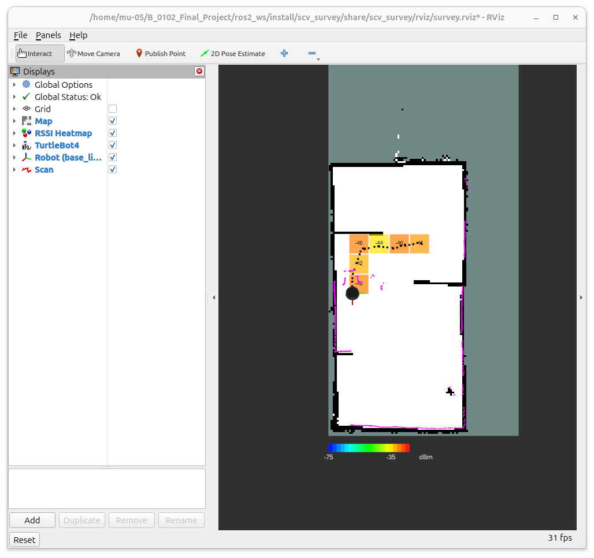

## 오늘 한 일
- scv_survey 노드 3개 작성: rssi_scanner(iw로 turtle08 RSSI 1 Hz → survey/raw), manual_tagger(시험용 위치 결합 → survey/sample), network_map_engine(0.5 m 칸 히트맵 → /survey/heatmap, CSV 기록)
- 1차 시험: 노트북을 들고 사람이 직접 이동, RViz Publish Point로 찍은 자리에서 5개씩 측정 → test_map 위에 칸 표시
- 2차 시험: 로봇 3번 위에 노트북을 얹고 AMCL TF(map→base_link)로 위치 결합, teleop으로 움직이며 측정 → 지나간 칸 표시
- 칸 색을 NetSpot 식으로 변경: 강할수록 빨강 → 노랑 → 초록 → 하늘 → 약할수록 파랑(−35 ~ −75 dBm), 미검출은 회색, 지도 아래 범례

## 시행착오
- 노트북에 iw 없음 → `sudo apt install iw`. iw 값과 /proc/net/wireless 8/8 일치 확인
- TF 지연 150 ms에서 이전 위치가 붙어 32개 중 3개가 다른 칸에 들어감 → 측정 시각 TF를 최대 0.5 s 기다려 보간 → 위치 오차 ≤ 0.001 m, 다른 칸 0
- 노트북 시계가 로봇보다 늦으면 과거 위치가 경고 없이 붙음 → "지금 − 최근 TF 시각" 차이를 따로 검사해 0.5 s 넘으면 제외
- AMCL이 위치를 못 잡음: undock 위치를 스스로 모름(set_initial_pose: False) → 초기위치를 직접 넣음
- 초기위치를 (0, 0, yaw 0)으로 넣으니 스캔이 지도 밖으로 돎 → 로봇 3번 undock 위치는 지도 원점이지만 방향이 맞지 않아, 180도 돌려 수정
- 초기위치 공분산을 RViz 기본(0.25)으로 주니 AMCL 공분산 0.50에서 시작 → 0.25 아래로 내려갈 때까지 약 3분, 샘플 89개 제외
- RViz에 TF 축만 보이고 로봇이 안 보임 → RobotModel 추가, /robot_description → /robot3/robot_description 연결

## 강조하고 싶은 것 / 달성
<!-- 이 줄은 노션에 안 나가요. 그림:   이름에 빈칸이 있으면 
     영상: video: video/YYYY-MM-DD_이름.mp4 설명   YouTube: video: https://youtu.be/… 설명 -->
- ✅ 단위테스트 통과: scv_survey pytest (iw 해석·칸·색·통계·위치 판정)
  - 단계: 1 단위 · IF-02·08 · mock
  - 기준: 전부 통과
  - 결과: 35 / 35 통과
- ✅ 단위테스트 통과: manual_tagger(manual)·network_map_engine 노트북 수동 측정 표시
  - 단계: 1 단위 · IF-02·08 · 노트북 (turtle08 실측)
  - 기준: 클릭한 자리 칸에 6초 안에 표시, 위치 오차 1칸 이하
  - 결과: 초기위치 (0, 0) 중앙값 −47 dBm 검출 5/5, 클릭 (−2.80, 0.47) 중앙값 −47 dBm 검출 5/5 → 클릭 4.3초 뒤 그 칸에 표시

- ✅ 단위테스트 통과: manual_tagger(tf) 로봇 TF 위치 결합 히트맵
  - 단계: 2 두 기능 (RSSI + AMCL 위치) · IF-02·08 · 로봇 3번
  - 기준: TF 지연 0.5 s 이하, 샘플 위치 = TF 위치, 위치 확실한 샘플만 지도에 표시
  - 결과: 지도에 쓴 샘플 131개 · 칸 8개 · RSSI −46 ~ −35 dBm(칸 중앙값 −44 ~ −40) · 미검출 0 · TF 지연 0.02–0.07 s · 마지막 위치 TF·샘플·로그 모두 (−2.53, −1.99)

- ✅ 단위테스트 통과: manual_tagger(tf) 위치 결합 정확도
  - 단계: 1 단위 · IF-02·08 · mock (가짜 로봇 TF, map→odom 어긋남 포함)
  - 기준: TF 지연 300 ms까지 위치 오차 0.05 m 이하, 다른 칸 0, 시계 2 s 어긋남은 제외
  - 결과: 지연 0·150·300 ms 위치 오차 ≤ 0.001 m · 다른 칸 0 · RViz 칸 13개 = CSV 재계산 · 시계 ±2 s 어긋남 샘플 제외

## 내일 할 일
- 핫스팟으로 wifi를 킨 상태로 테스트
- 나타난 음영지역에 cost추가를 통해 장애물로 인식시키기

## 막힌 것 (PM 도움 필요)
- 없음
