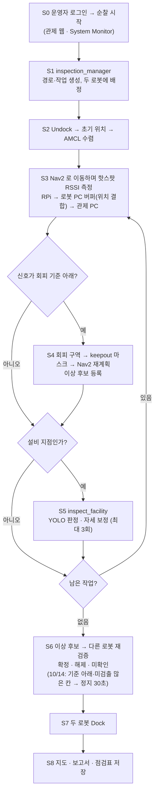
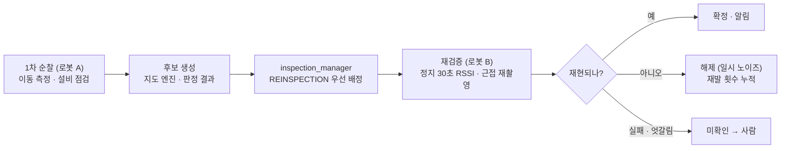
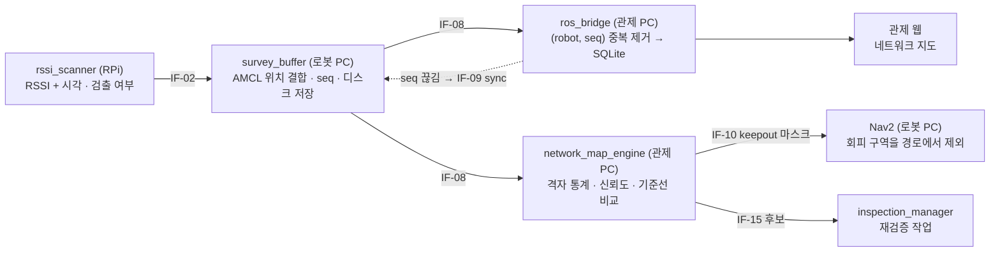
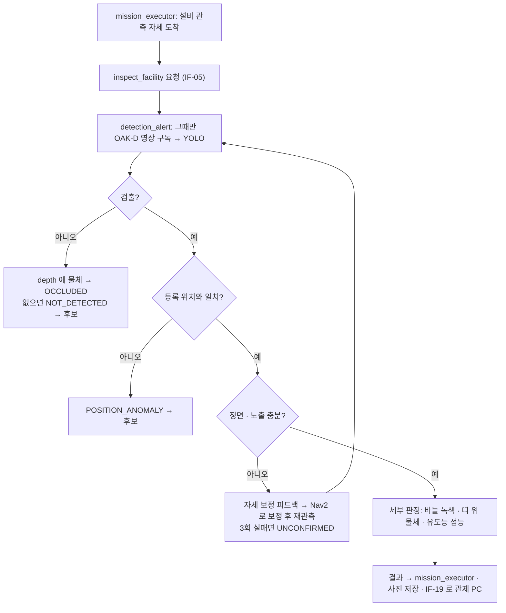

# SCV Process Flow (제출용 초안 v0.1)

> 원본은 노션 「SCV 설계」 — 제출 직전에 다시 뽑는다.

2026-10-10 · 작성 도윤 (PM) · 출처: 팀 노션 「SCV 설계」 3·10장, 시스템 다이어그램 v0.9. GitHub 에서 열면 그림으로 보입니다. 한 장짜리 전체 그림(기기 스택·인터페이스·노드별 흐름)은 팀 노션의 System Diagram 이 원본입니다.

## 1. As-Is → To-Be

| As-Is | To-Be |
| --- | --- |
| Wi-Fi 는 문제가 생겨야 외주 측정 → 사람이 현장 전체를 걷고 → 일회성 보고서 | 두 대가 순찰하며 자동 측정 → 통계·기준선 지도 → 이상 후보 |
| 배치가 바뀌어도 지도는 그대로, 로봇·단말이 멈춘 뒤에야 음영을 안다 | 후보는 다른 로봇이 재검증 → 확정된 것만 담당자에게 |
| 한 번 낮게 나온 값이 노이즈인지 실제 문제인지 구분할 방법이 없다 | 담당자는 보고서로 AP 조정·투자 판단, 다음 순찰에서 개선 확인 |
| 소방 설비는 법정 점검 연 1–2회, 평소엔 작업자 눈에 의존 | 같은 순찰에서 소방 설비 판정 → 알림 → 조치 → 해소 확인 |

## 2. 순찰 한 번 (S0–S8)

## 3. 이상 후보 재검증 (BR-T06)

- 후보를 만든 로봇이 아닌 다른 로봇이 다른 조건(정지·근접)으로 확인한다. 로봇이 한 대뿐이면 같은 로봇이 순찰 끝에 재방문하고 그 사실을 기록한다.
- 음영 후보는 회피 구역 안쪽이 아니라 경계 칸에서 정지 측정한다.

## 4. 측정 데이터가 지도가 되기까지

## 5. 설비 점검 한 건

## 6. 예외 처리 (E1–E8)

| 번호 | 상황 | 감지 | 대응 |
| --- | --- | --- | --- |
| E1 | 통로 막힘 | LiDAR 장애물, 진행 정체 | 5초 대기·재계획 → 10초 안에 안 되면 건너뛰고 재방문 목록 |
| E2 | 배터리 30 % / 15 % | 배터리 상태 | 새 작업을 받지 않고 인계 / 즉시 Dock |
| E3 | 로봇 응답 없음 | status 30초 끊김 | 60초 안에 남은 작업을 다른 로봇에 재배정 |
| E4 | 관제 PC 연결 끊김 | 로봇 PC 에서 응답 없음 | 받은 작업은 끝까지(설비 판정 포함) · 샘플은 로봇 PC 에 보관 → 재연결 때 전송 |
| E5 | 위치 불확실 | AMCL 공분산 큼 | 그 샘플을 지도 계산에서 제외 · 오래가면 경보 |
| E6 | 정면 아님·가림·어두움 | 정면 판별 실패 | 자세 보정 재관측 최대 3회 → 미확인 |
| E7 | 비상정지 | 관제 웹 버튼 | 두 로봇 goal 취소·정지, 재개 명령 대기 |
| E8 | DB 쓰기 실패 | 저장 예외 | 메모리 큐·재시도·경보, 복구 뒤 순서대로 저장 |
