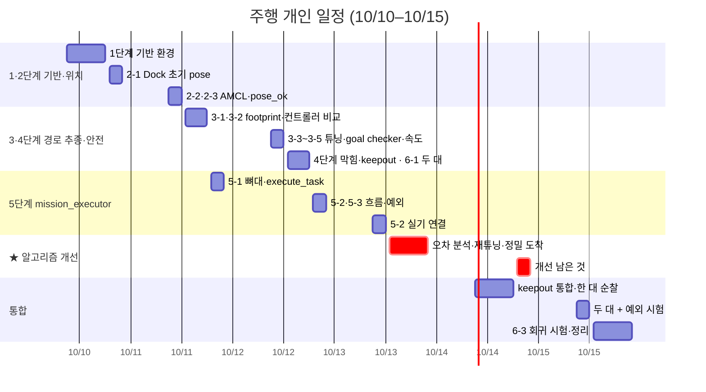

# 주행 개인 일정표 (초안 v0.2, 10/10–10/15)

담당 hhj · 기준 `docs/driving/PLAN.md` v0.2 · 번호는 PLAN.md 단계 번호

**원칙:** 단독 개발은 10/12 저녁까지 끝내고, 10/13 오후부터는 **알고리즘 개선**(경로 추종 오차 분석과 재튜닝)에 씁니다. 10/14–15는 통합과 회귀 시험입니다. 로봇이 필요한 작업은 오전·오후에, 코드 작업(mission_executor)은 저녁에 합니다.

## 간트 차트

GitHub에서 열면 가로 막대 그래프로 보입니다. 오전 09–12시, 오후 13–18시, 저녁 19–22시 기준입니다.

## 시간표

| 날짜 | 오전 | 오후 | 저녁 |
| --- | --- | --- | --- |
| **10/10** | 1-1 Nav2 bringup · 1-2 Wi-Fi 지연 기준 · 1-3 cmd_vel 끊김 확인 | 1-4 odom 오차 측정 · 1-5 SLAM → map.yaml 배포 | 2-1 Dock 초기 pose 설정 · 5-1 mission_executor 뼈대 |
| **10/11** | 2-2 AMCL 튜닝 · 2-3 pose_ok 기준 | 3-1 통로 폭 실측·footprint · 3-2 컨트롤러 비교 (MPPI vs RPP) | 5-1 execute_task 서버 + SURVEY · 가짜 manager 왕복 |
| **10/12** | 3-3 컨트롤러 튜닝 · 3-4 정밀 goal checker · 3-5 측정 속도 확정 | 4-2 막힘 규칙(E1) · 4-1 keepout 연결 · 6-1 두 대 동시 주행 | 5-2 FACILITY·REINSPECTION (가짜 서버) · 5-3 예외·Dock·status |
| **10/13** | 5-2 실기 연결 (비전·RSSI 1건씩) | ★ **알고리즘 개선**: 오차 분석 → 컨트롤러·AMCL 재튜닝 | ★ **알고리즘 개선**: 정밀 도착 보정 · 정확도 측정 기록 |
| **10/14** 통합 | keepout 통합: 핫스팟 끄기 → 5초 재계획 | 로봇 한 대 순찰 한 번 · 6-2 웨이포인트 간격 | 통합 버그 수정 · ★ 개선 남은 것 |
| **10/15** 통합 | 두 대 + 예외 시험 (재배정·비상정지) | 6-3 정확도 회귀 시험 (두 로봇) | 결과 기록 · PLAN.md 갱신 · 버퍼 |

## 날짜별로 다른 팀에서 받아야 할 것

| 날짜 | 받아야 할 것 (누구) | 늦을 때 대안 |
| --- | --- | --- |
| 10/10 | 공통 환경 Discovery Server·네임스페이스, 테스트베드 배치 (PM) | SLAM을 저녁으로 미루고 1-1–1-4 먼저 |
| 10/11 | scv_msgs 빌드 (PM) · map.yaml 전달 (주행 → RSSI·관제) | 임시 메시지로 뼈대만 |
| 10/12 | 측정 속도 합의·keepout 마스크 형식 (RSSI) · mock manager (PM) · 두 번째 로봇 시간 (PM) | 4-1은 10/14 통합으로, 6-1은 10/13 오전으로 |
| 10/13 | inspect_facility 서버 (비전) · precise 액션 (RSSI) · status 필드 (관제) | 가짜 서버로 흐름만 확인, 실기는 10/14 |
| 10/14–15 | keepout 마스크 발행 (RSSI) · 작업 배정 (관제) · 통합 시험 주관·Dock 10회 (PM) | — |

## 일정 위험

- **로봇 시간:** 10/10–10/13 오전·오후에 로봇 한 대를 거의 계속 써야 하므로, PM 시간표에서 먼저 확보해야 합니다.
- **10/12가 가장 빡빡함:** 튜닝과 예외 처리가 몰려 있어서, 밀리면 10/13 개선 시간에서 먼저 메웁니다.
- **알고리즘 개선 시간(★):** 10/13 오후·저녁과 10/14 저녁, 합쳐서 반나절 세 번입니다.
